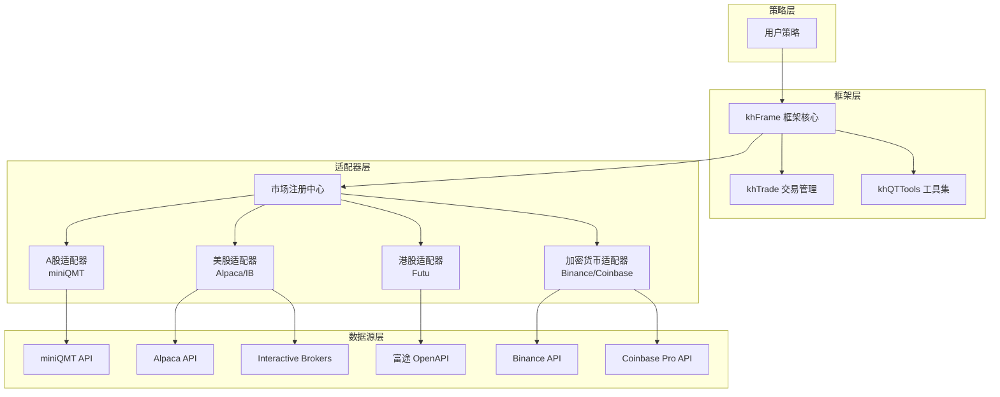
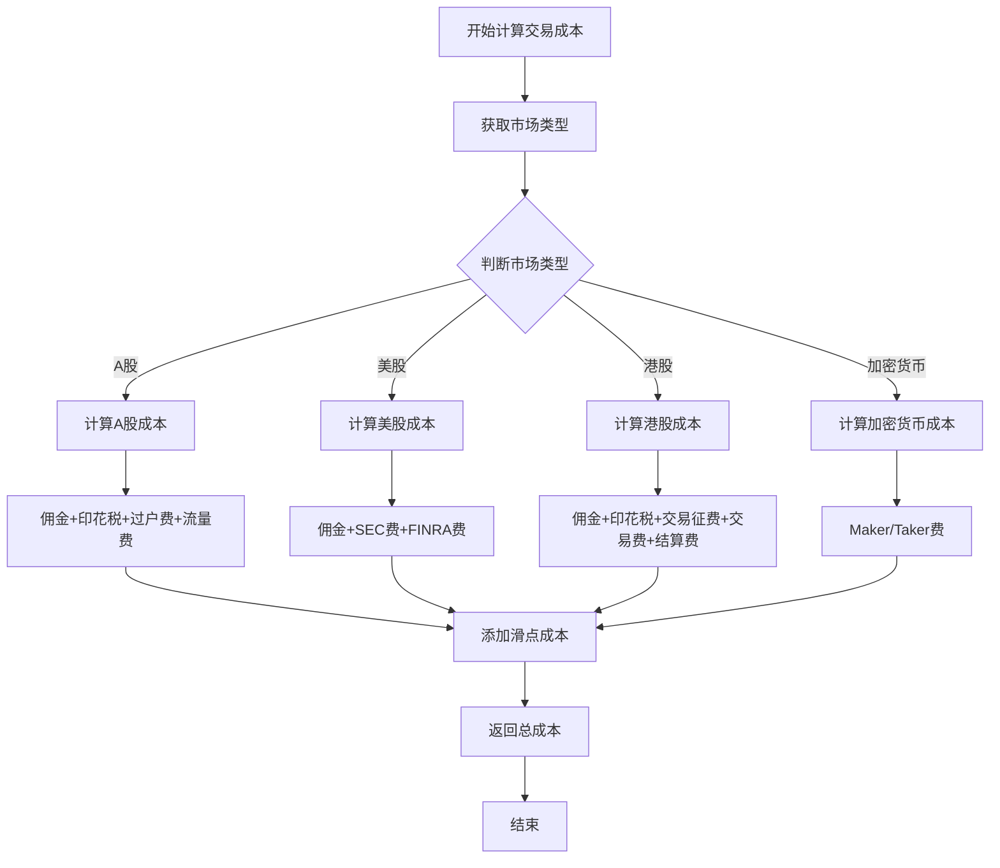
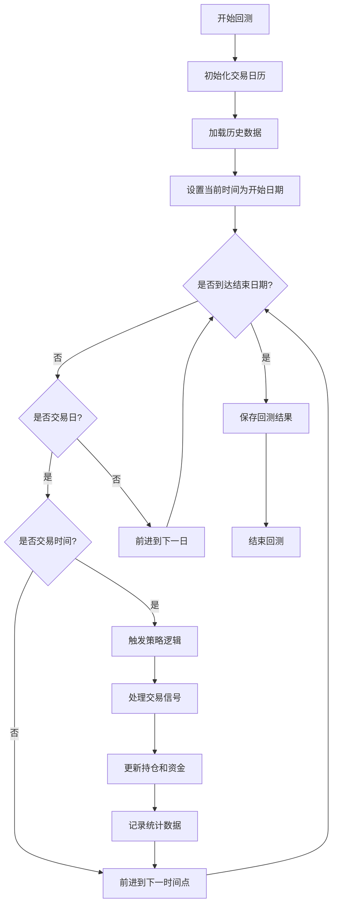
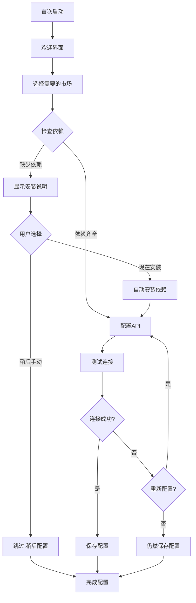

# 多市场交易功能扩展设计文档

## 1. 概述

### 1.1 设计目标

在现有A股量化交易系统基础上,扩展支持以下市场的量化交易功能:
- **美股市场** (US Stock Market)
- **港股市场** (Hong Kong Stock Market)  
- **虚拟货币市场** (Cryptocurrency Market: Bitcoin, Ethereum等)

### 1.2 系统现状分析

当前系统特征:
- **数据来源**: 完全依赖miniQMT提供的A股行情数据和交易接口
- **市场范围**: 仅支持A股(沪深股票、ETF、部分期货期权)
- **股票代码格式**: 使用miniQMT标准格式(如 `000001.SZ`, `600000.SH`)
- **核心模块**: khFrame.py、khTrade.py、khQTTools.py、khConfig.py
- **架构特点**: 模块低耦合设计,便于扩展

### 1.3 设计原则

- **数据源抽象化**: 将数据获取逻辑与具体数据提供商解耦
- **市场适配器模式**: 为不同市场创建统一的适配器接口
- **配置驱动**: 通过配置文件切换不同市场和数据源
- **向后兼容**: 保持现有A股功能完全不变
- **模块化扩展**: 新增功能以插件方式集成

## 2. 架构设计

### 2.1 整体架构



### 2.2 市场适配器接口定义

所有市场适配器必须实现统一的接口规范:

#### 基础接口

| 方法名称 | 功能说明 | 参数 | 返回值 |
|---------|---------|------|--------|
| `connect()` | 连接到数据源 | 无 | bool: 连接是否成功 |
| `disconnect()` | 断开连接 | 无 | bool: 断开是否成功 |
| `is_connected()` | 检查连接状态 | 无 | bool: 是否已连接 |
| `get_market_info()` | 获取市场基本信息 | 无 | dict: 市场信息 |

#### 数据接口

| 方法名称 | 功能说明 | 参数 | 返回值 |
|---------|---------|------|--------|
| `get_symbols(category)` | 获取标的列表 | category: 分类(股票/期货/加密货币等) | list[dict]: 标的信息列表 |
| `get_market_data(symbols, period, start, end, fields, dividend_type)` | 获取历史行情数据 | symbols: 标的代码列表<br/>period: 周期<br/>start/end: 时间范围<br/>fields: 数据字段<br/>dividend_type: 复权方式 | DataFrame: 行情数据 |
| `download_history_data(symbols, period, start, end)` | 下载历史数据到本地 | symbols: 标的代码列表<br/>period: 周期<br/>start/end: 时间范围 | bool: 是否成功 |
| `subscribe_quote(symbols, callback)` | 订阅实时行情 | symbols: 标的代码<br/>callback: 回调函数 | bool: 订阅是否成功 |
| `unsubscribe_quote(symbols)` | 取消行情订阅 | symbols: 标的代码 | bool: 是否成功 |

#### 交易接口

| 方法名称 | 功能说明 | 参数 | 返回值 |
|---------|---------|------|--------|
| `get_account_info()` | 获取账户信息 | 无 | dict: 账户余额、可用资金等 |
| `get_positions()` | 获取持仓信息 | 无 | list[dict]: 持仓列表 |
| `place_order(symbol, side, quantity, price, order_type)` | 下单 | symbol: 标的代码<br/>side: buy/sell<br/>quantity: 数量<br/>price: 价格<br/>order_type: 订单类型 | dict: 订单信息 |
| `cancel_order(order_id)` | 撤单 | order_id: 订单ID | bool: 是否成功 |
| `get_order_status(order_id)` | 查询订单状态 | order_id: 订单ID | dict: 订单状态 |
| `get_trade_history(start, end)` | 获取成交记录 | start/end: 时间范围 | list[dict]: 成交记录 |

#### 市场特有接口

| 方法名称 | 功能说明 | 参数 | 返回值 |
|---------|---------|------|--------|
| `normalize_symbol(symbol)` | 标准化标的代码格式 | symbol: 原始代码 | str: 标准化后的代码 |
| `get_trading_calendar(start, end)` | 获取交易日历 | start/end: 时间范围 | list[date]: 交易日列表 |
| `get_market_hours()` | 获取交易时间段 | 无 | list[tuple]: 时间段列表 |
| `calculate_commission(price, quantity, side)` | 计算交易费用 | price: 价格<br/>quantity: 数量<br/>side: 买卖方向 | dict: 费用明细 |

### 2.3 数据标准化

#### 2.3.1 标的代码标准化

不同市场使用统一的内部代码格式:

| 市场 | 原始格式示例 | 标准化格式 | 说明 |
|------|------------|----------|------|
| A股 | 000001.SZ | CN.000001.SZ | 增加CN前缀标识中国市场 |
| A股 | 600000.SH | CN.600000.SH | 增加CN前缀标识中国市场 |
| 美股 | AAPL | US.AAPL | 增加US前缀标识美国市场 |
| 美股 | TSLA | US.TSLA | 增加US前缀标识美国市场 |
| 港股 | 00700 | HK.00700 | 增加HK前缀标识香港市场 |
| 港股 | 09988 | HK.09988 | 增加HK前缀标识香港市场 |
| 加密货币 | BTCUSDT | CRYPTO.BTC.USDT | 区分交易对 |
| 加密货币 | ETHUSDT | CRYPTO.ETH.USDT | 区分交易对 |

#### 2.3.2 时间标准化

所有时间统一使用UTC时区,并在适配器层进行本地时区转换:

| 市场 | 交易时区 | 转换规则 |
|------|---------|---------|
| A股 | UTC+8 | 本地时间直接使用 |
| 美股 | UTC-5 (EST) / UTC-4 (EDT) | 需考虑夏令时转换 |
| 港股 | UTC+8 | 与A股相同 |
| 加密货币 | UTC | 无需转换,24/7交易 |

#### 2.3.3 数据字段标准化

统一的行情数据字段定义:

| 标准字段名 | 字段说明 | 数据类型 | A股字段映射 | 美股字段映射 | 加密货币字段映射 |
|-----------|---------|---------|-----------|-----------|---------------|
| symbol | 标的代码 | string | stock_code | symbol | symbol |
| timestamp | 时间戳 | datetime | time | timestamp | timestamp |
| open | 开盘价 | float | open | open | open |
| high | 最高价 | float | high | high | high |
| low | 最低价 | float | low | low | low |
| close | 收盘价 | float | close | close | close |
| volume | 成交量 | float | volume | volume | volume |
| amount | 成交额 | float | amount | N/A | quote_volume |
| bid_price | 买一价 | float | bidPrice[0] | bid | bid |
| ask_price | 卖一价 | float | askPrice[0] | ask | ask |

## 3. 数据源适配方案

### 3.1 美股数据源选型

#### 3.1.1 推荐数据源

| 数据源 | 类型 | 优势 | 限制 | 推荐度 |
|-------|------|------|------|--------|
| Alpaca | API | 免费实时数据,支持回测,易于集成 | 仅支持美股,需要账户 | ⭐⭐⭐⭐⭐ |
| Interactive Brokers | API | 全球市场覆盖,专业级 | 配置复杂,有最低资金要求 | ⭐⭐⭐⭐ |
| Yahoo Finance | API | 完全免费,无需注册 | 数据延迟,可靠性一般 | ⭐⭐⭐ |
| Polygon.io | API | 高质量数据,支持tick级别 | 免费版有限制 | ⭐⭐⭐⭐ |

#### 3.1.2 美股适配器实现要点

关键特性处理:

- **交易时间**: 美东时间 9:30-16:00 (盘前 4:00-9:30, 盘后 16:00-20:00)
- **最小价格变动**: 通常为0.01美元
- **交易单位**: 以股为单位,无A股100股整数倍限制
- **涨跌幅限制**: 无涨跌停板制度,但有熔断机制
- **T+0交易**: 支持当日买卖,但有PDT规则(Pattern Day Trader)限制
- **卖空规则**: 支持卖空,需借券

费用计算规则:

| 费用项 | 计算方式 | 备注 |
|-------|---------|------|
| 佣金 | 通常0-0.005美元/股 | 取决于券商 |
| SEC费用 | 卖出金额 × 0.0000278 | 仅卖出时收取 |
| FINRA交易费 | 卖出数量 × 0.000166 (上限5.95美元) | 仅卖出时收取 |

### 3.2 港股数据源选型

#### 3.2.1 推荐数据源

| 数据源 | 类型 | 优势 | 限制 | 推荐度 |
|-------|------|------|------|--------|
| 富途牛牛 OpenAPI | API | 完整港股支持,中文文档 | 需要开通账户 | ⭐⭐⭐⭐⭐ |
| Interactive Brokers | API | 全球市场,专业级 | 配置复杂 | ⭐⭐⭐⭐ |
| 老虎证券 OpenAPI | API | 支持港股美股,易用 | 需开户 | ⭐⭐⭐⭐ |

#### 3.2.2 港股适配器实现要点

关键特性处理:

- **交易时间**: 港股时间 9:30-12:00, 13:00-16:00 (与A股相同时区)
- **股票代码**: 5位数字编号 (如 00700腾讯, 09988阿里)
- **最小价格变动**: 根据价格区间不同(0.001-5港元不等)
- **交易单位**: 每手股数不同(100股、500股、1000股等)
- **涨跌幅限制**: 无涨跌停限制
- **T+0交易**: 不支持,T+2交收

费用计算规则:

| 费用项 | 计算方式 | 备注 |
|-------|---------|------|
| 佣金 | 通常成交金额 × 0.03% | 取决于券商,有最低收费 |
| 印花税 | 成交金额 × 0.13% | 买卖双向收取 |
| 交易征费 | 成交金额 × 0.00565% | 买卖双向收取 |
| 交易费 | 成交金额 × 0.005% | 买卖双向收取 |
| 结算费 | 成交金额 × 0.002% | 买卖双向收取 |

### 3.3 虚拟货币数据源选型

#### 3.3.1 推荐数据源

| 数据源 | 类型 | 优势 | 限制 | 推荐度 |
|-------|------|------|------|--------|
| Binance | API | 最大交易量,免费API,丰富功能 | 部分地区限制 | ⭐⭐⭐⭐⭐ |
| Coinbase Pro | API | 合规性强,美国用户友好 | API限流较严格 | ⭐⭐⭐⭐ |
| CCXT | 统一库 | 支持100+交易所,统一接口 | 需额外封装 | ⭐⭐⭐⭐⭐ |
| Kraken | API | 老牌交易所,稳定可靠 | 币种相对较少 | ⭐⭐⭐ |

#### 3.3.2 虚拟货币适配器实现要点

关键特性处理:

- **交易时间**: 7×24小时全天候交易,无休市
- **交易对格式**: BTC/USDT, ETH/USDT, BTC/ETH等
- **最小交易量**: 各币种不同(如BTC最小0.00001)
- **价格精度**: 各交易对不同(通常8位小数)
- **无涨跌幅限制**: 价格波动可能极大
- **高频特性**: 适合高频交易策略

费用计算规则 (以Binance为例):

| 费用项 | Maker费率 | Taker费率 | 备注 |
|-------|----------|----------|------|
| 现货交易 | 0.1% | 0.1% | 持有BNB可享折扣 |
| 合约交易 | 0.02% | 0.04% | 根据VIP等级调整 |

特殊考虑:

- **提币费用**: 各币种不同,需单独配置
- **网络拥堵**: 链上确认时间不确定
- **交易深度**: 小币种流动性差,需防滑点过大

## 4. 配置系统扩展

### 4.1 配置文件结构扩展

在现有.kh配置文件基础上,扩展支持多市场配置:

#### 4.1.1 市场选择配置

```
market: 
  type: <market_type>  # 可选值: china_a_stock | us_stock | hk_stock | cryptocurrency
  name: <market_name>  # 市场显示名称
```

#### 4.1.2 数据源配置

```
data_source:
  provider: <provider_name>  # 数据提供商名称
  api_key: <api_key>         # API密钥 (加密存储)
  api_secret: <api_secret>   # API密钥 (加密存储)
  endpoint: <endpoint_url>   # API端点地址
  timeout: <timeout_seconds> # 超时时间
```

#### 4.1.3 A股配置示例

```
market:
  type: china_a_stock
  name: A股市场
  
data_source:
  provider: miniQMT
  userdata_path: D:\国金证券QMT交易端\userdata_mini
  client_path: D:\国金证券QMT交易端\bin.x64\XtItClient.exe

data:
  stock_list: 
    - CN.000001.SZ
    - CN.600000.SH
  kline_period: 1d
  dividend_type: front
```

#### 4.1.4 美股配置示例

```
market:
  type: us_stock
  name: 美股市场
  
data_source:
  provider: alpaca
  api_key: <your_api_key>
  api_secret: <your_api_secret>
  endpoint: https://paper-api.alpaca.markets
  paper_trading: true

data:
  stock_list:
    - US.AAPL
    - US.TSLA
    - US.MSFT
  kline_period: 1d
  dividend_type: none

backtest:
  trade_cost:
    commission_rate: 0.0  # Alpaca免佣金
    min_commission: 0.0
    stamp_tax_rate: 0.0
    sec_fee_rate: 0.0000278  # SEC费用
    finra_taf_rate: 0.000166  # FINRA交易费
```

#### 4.1.5 港股配置示例

```
market:
  type: hk_stock
  name: 港股市场
  
data_source:
  provider: futu
  api_key: <your_api_key>
  api_secret: <your_api_secret>
  host: 127.0.0.1
  port: 11111

data:
  stock_list:
    - HK.00700  # 腾讯控股
    - HK.09988  # 阿里巴巴
  kline_period: 1d
  dividend_type: none

backtest:
  trade_cost:
    commission_rate: 0.0003  # 0.03%
    min_commission: 3.0      # 最低3港元
    stamp_tax_rate: 0.0013   # 0.13%
    trading_fee_rate: 0.00565  # 0.00565%
```

#### 4.1.6 加密货币配置示例

```
market:
  type: cryptocurrency
  name: 加密货币市场
  
data_source:
  provider: binance
  api_key: <your_api_key>
  api_secret: <your_api_secret>
  endpoint: https://api.binance.com
  testnet: false

data:
  symbol_list:
    - CRYPTO.BTC.USDT
    - CRYPTO.ETH.USDT
  kline_period: 1h
  
backtest:
  trade_cost:
    maker_fee_rate: 0.001  # 0.1%
    taker_fee_rate: 0.001  # 0.1%
    min_commission: 0.0
```

### 4.2 配置管理模块扩展

khConfig.py需要扩展以下功能:

#### 新增属性

| 属性名 | 类型 | 说明 |
|-------|------|------|
| market_type | str | 市场类型标识 |
| data_provider | str | 数据提供商名称 |
| api_credentials | dict | API认证信息 (加密存储) |
| market_adapter | object | 市场适配器实例 |

#### 新增方法

| 方法名 | 功能说明 |
|-------|---------|
| `load_market_config()` | 加载市场配置 |
| `validate_market_config()` | 验证市场配置有效性 |
| `get_adapter()` | 获取当前市场的适配器实例 |
| `encrypt_credentials()` | 加密API凭证 |
| `decrypt_credentials()` | 解密API凭证 |

## 5. 交易成本计算扩展

### 5.1 交易成本模型抽象

定义统一的交易成本计算接口:

#### 成本组成

所有市场的交易成本包含以下可选项:

| 成本项 | 说明 | A股 | 美股 | 港股 | 加密货币 |
|-------|------|-----|-----|-----|---------|
| 佣金 (Commission) | 券商收取的交易佣金 | ✓ | ✓ | ✓ | ✓ |
| 印花税 (Stamp Tax) | 政府收取的税费 | ✓(仅卖出) | ✗ | ✓(双向) | ✗ |
| 过户费 (Transfer Fee) | 登记结算机构收取 | ✓(仅沪市) | ✗ | ✗ | ✗ |
| 监管费 (Regulatory Fee) | 监管机构收取 | ✗ | ✓(SEC/FINRA) | ✓ | ✗ |
| 交易征费 (Trading Fee) | 交易所收取 | ✗ | ✗ | ✓ | ✗ |
| 结算费 (Settlement Fee) | 结算机构收取 | ✗ | ✗ | ✓ | ✗ |
| Maker/Taker费 | 挂单/吃单费用 | ✗ | ✗ | ✗ | ✓ |
| 流量费 (Data Fee) | 数据使用费 | ✓ | ✗ | ✗ | ✗ |
| 滑点 (Slippage) | 价格影响成本 | ✓ | ✓ | ✓ | ✓ |

### 5.2 khTrade模块扩展

扩展KhTradeManager类以支持多市场费用计算:

#### 扩展方法

| 方法名 | 功能说明 |
|-------|---------|
| `set_market_cost_model(market_type)` | 设置市场费用模型 |
| `calculate_us_stock_cost()` | 计算美股交易成本 |
| `calculate_hk_stock_cost()` | 计算港股交易成本 |
| `calculate_crypto_cost()` | 计算加密货币交易成本 |
| `get_lot_size(symbol)` | 获取标的交易单位(港股特有) |
| `get_tick_size(symbol, price)` | 获取最小价格变动(港股特有) |

#### 费用计算流程



## 6. GUI界面扩展

### 6.1 市场选择器

在主界面左侧配置区新增"市场选择"组:

#### 界面元素

| 控件类型 | 功能说明 | 位置 |
|---------|---------|------|
| 下拉框 | 选择交易市场 | 策略配置组上方 |
| 数据源配置按钮 | 配置所选市场的数据源 | 市场选择下拉框右侧 |
| 连接状态指示灯 | 显示数据源连接状态 | 数据源配置按钮右侧 |

#### 市场选项

| 显示文本 | 内部值 | 图标 |
|---------|--------|------|
| A股市场 | china_a_stock | 🇨🇳 |
| 美股市场 | us_stock | 🇺🇸 |
| 港股市场 | hk_stock | 🇭🇰 |
| 加密货币 | cryptocurrency | ₿ |

### 6.2 数据源配置对话框

为不同市场提供专用的数据源配置界面:

#### A股数据源配置

| 配置项 | 类型 | 说明 |
|-------|------|------|
| miniQMT客户端路径 | 文件选择 | XtItClient.exe路径 |
| miniQMT用户数据路径 | 文件夹选择 | userdata_mini路径 |

#### 美股数据源配置

| 配置项 | 类型 | 说明 |
|-------|------|------|
| 数据提供商 | 下拉选择 | Alpaca / Interactive Brokers / Yahoo Finance |
| API Key | 文本输入 | 密钥(密文显示) |
| API Secret | 密码输入 | 密钥(密文显示) |
| 模拟交易模式 | 复选框 | 是否使用Paper Trading |
| 测试连接 | 按钮 | 验证API配置是否正确 |

#### 港股数据源配置

| 配置项 | 类型 | 说明 |
|-------|------|------|
| 数据提供商 | 下拉选择 | 富途OpenAPI / 老虎证券 / IB |
| API Key | 文本输入 | 密钥(密文显示) |
| API Secret | 密码输入 | 密钥(密文显示) |
| 连接地址 | 文本输入 | Host和Port |
| 测试连接 | 按钮 | 验证配置 |

#### 加密货币数据源配置

| 配置项 | 类型 | 说明 |
|-------|------|------|
| 交易所选择 | 下拉选择 | Binance / Coinbase / Kraken / 使用CCXT |
| API Key | 文本输入 | 密钥(密文显示) |
| API Secret | 密码输入 | 密钥(密文显示) |
| 测试网络 | 复选框 | 是否使用Testnet |
| 测试连接 | 按钮 | 验证配置 |

### 6.3 股票池管理扩展

#### 标的代码输入适配

- **智能识别**: 自动识别输入的代码格式并添加市场前缀
- **批量导入**: 支持从CSV导入不同市场的标的列表
- **代码验证**: 实时验证输入的代码是否有效

#### 市场分类显示

在股票池表格中增加"市场"列:

| 标的代码 | 标的名称 | 市场 | 操作 |
|---------|---------|------|-----|
| CN.000001.SZ | 平安银行 | A股 | 删除 |
| US.AAPL | Apple Inc. | 美股 | 删除 |
| HK.00700 | 腾讯控股 | 港股 | 删除 |
| CRYPTO.BTC.USDT | Bitcoin/USDT | 加密货币 | 删除 |

### 6.4 回测参数适配

#### 基准合约选择

根据所选市场自动切换可用基准:

| 市场 | 默认基准 | 可选基准列表 |
|------|---------|------------|
| A股 | sh.000300 (沪深300) | 上证指数, 深证成指, 创业板指 等 |
| 美股 | US.SPY (标普500 ETF) | ^GSPC (标普500), ^DJI (道琼斯), ^IXIC (纳斯达克) |
| 港股 | HK.^HSI (恒生指数) | 恒生科技指数, 国企指数 等 |
| 加密货币 | CRYPTO.BTC.USDT | 无基准(或使用BTC作为基准) |

#### 交易成本预设

点击"市场"选择后,自动加载对应市场的典型费率:

- A股: 默认A股费率
- 美股: Alpaca零佣金或IB佣金
- 港股: 典型港股综合费率
- 加密货币: 交易所标准费率

## 7. 策略编写适配

### 7.1 策略API统一性

保持策略编写接口的一致性,屏蔽市场差异:

#### 核心函数签名保持不变

| 函数名 | 说明 | 多市场适配 |
|-------|------|-----------|
| `init(stocks, data)` | 策略初始化 | 无需修改 |
| `khHandlebar(data)` | 主策略逻辑 | 无需修改 |
| `khPreMarket(data)` | 盘前处理 | 需适配不同市场交易时间 |
| `khPostMarket(data)` | 盘后处理 | 需适配不同市场交易时间 |

#### 数据访问函数扩展

| 函数名 | 原功能 | 扩展支持 |
|-------|--------|---------|
| `khPrice(data, symbol, field)` | 获取价格数据 | 自动适配市场代码格式 |
| `khGet(data, key)` | 获取数据字段 | 统一字段名映射 |
| `khMA(symbol, period, end_time)` | 计算移动平均 | 调用对应市场适配器 |
| `khHas(data, symbol)` | 检查持仓 | 标准化symbol格式 |

#### 新增市场信息函数

| 函数名 | 功能说明 | 示例 |
|-------|---------|------|
| `khGetMarket()` | 获取当前策略运行的市场类型 | 返回 "us_stock" |
| `khIsTradeTime()` | 判断当前是否交易时间 | 根据市场返回True/False |
| `khGetTickSize(symbol, price)` | 获取最小价格变动 | 港股价格档位处理 |
| `khGetLotSize(symbol)` | 获取最小交易单位 | 港股每手股数 |
| `khConvertCurrency(amount, from_curr, to_curr)` | 货币转换 | 跨市场策略使用 |

### 7.2 多市场策略示例

#### 美股双均线策略示例

基于原有双均线策略的美股改造版本:

**策略特点**:
- 使用美股标的 (US.AAPL)
- 适配美股交易时间和规则
- T+0交易特性支持

**核心逻辑描述**:

策略初始化:
- 设置标的代码为美股格式 (US.AAPL)
- 配置短期均线周期为5日
- 配置长期均线周期为20日

主策略逻辑:
- 获取当前标的代码和开盘价
- 计算5日移动平均线和20日移动平均线
- 检查当前持仓状态
- 交易信号生成规则:
  - 当5日线上穿20日线且无持仓时: 生成买入信号,全仓买入
  - 当5日线下穿20日线且有持仓时: 生成卖出信号,全仓卖出

#### 港股网格策略示例

针对港股市场特性的网格交易策略:

**策略特点**:
- 使用港股标的 (HK.00700 腾讯)
- 考虑港股手数交易特性
- 适配港股价格档位

**核心逻辑描述**:

策略初始化:
- 设置标的为腾讯控股 (HK.00700)
- 定义网格价格范围: 下限300港元, 上限500港元
- 设置网格数量: 10个网格
- 计算每个网格的价格间隔
- 获取该股票的每手股数 (使用khGetLotSize函数)

主策略逻辑:
- 获取当前价格
- 遍历所有网格:
  - 如果价格触及网格下边界且未持有该网格仓位: 买入一手
  - 如果价格触及网格上边界且持有该网格仓位: 卖出一手
- 确保每次交易数量为整手数

#### 加密货币动量策略示例

利用加密货币24/7交易特性的动量策略:

**策略特点**:
- 交易BTC/USDT和ETH/USDT
- 24小时连续运行
- 高频触发 (1分钟K线)

**核心逻辑描述**:

策略初始化:
- 设置监控标的: CRYPTO.BTC.USDT, CRYPTO.ETH.USDT
- 定义动量周期: 60分钟
- 设置动量阈值: 上涨3%触发买入, 下跌2%触发卖出

主策略逻辑:
- 计算每个标的过去60分钟的价格变动率
- 对于每个标的:
  - 如果动量 > 3% 且无持仓: 使用可用资金的30%买入
  - 如果动量 < -2% 且有持仓: 卖出全部仓位
- 因无交易时间限制,策略可在任意时间执行

### 7.3 策略移植指南

将现有A股策略迁移到其他市场的步骤:

#### 步骤1: 修改配置文件

- 更改market.type为目标市场
- 配置对应的数据源
- 更新stock_list为目标市场代码格式
- 调整交易成本参数

#### 步骤2: 调整代码格式

- 将股票代码改为标准化格式 (添加市场前缀)
- 检查并适配最小交易单位
- 美股: 无需100股整数倍
- 港股: 使用khGetLotSize获取每手股数
- 加密货币: 注意最小下单量

#### 步骤3: 适配交易规则

- T+0 vs T+1: 美股和加密货币支持T+0,需调整策略逻辑
- 涨跌停: 美股、港股、加密货币无涨跌停限制
- 交易时间: 使用khIsTradeTime检查

#### 步骤4: 复权处理

- A股: 通常使用前复权
- 美股: 通常不使用复权 (股票分割单独处理)
- 港股: 类似美股
- 加密货币: 无需复权

#### 步骤5: 测试验证

- 先使用模拟账户测试
- 验证交易成本计算正确性
- 检查持仓数量是否符合市场规则

## 8. 回测引擎适配

### 8.1 时间处理

#### 交易日历管理

不同市场使用各自的交易日历:

| 市场 | 休市日处理 | 数据来源 |
|------|-----------|---------|
| A股 | 使用holidays库的China | 本地库 |
| 美股 | 使用holidays库的UnitedStates + NYSE规则 | 本地库或API |
| 港股 | 使用holidays库的HongKong | 本地库或API |
| 加密货币 | 无休市日 (7×24交易) | 无需判断 |

#### 回测时间推进逻辑



### 8.2 数据加载优化

#### 分市场数据缓存

为不同市场维护独立的数据缓存:

| 缓存键格式 | 示例 | 说明 |
|-----------|------|------|
| `{market}:{symbol}:{period}:{date}` | `us_stock:US.AAPL:1d:20240101` | 精确定位数据 |

#### 数据预加载策略

| 市场 | 预加载范围 | 原因 |
|------|-----------|------|
| A股 | 回测区间 + 前250个交易日 | 计算年线等长周期指标 |
| 美股 | 回测区间 + 前250个交易日 | 同A股 |
| 港股 | 回测区间 + 前250个交易日 | 同A股 |
| 加密货币 | 回测区间 + 前365天 | 无休市,用自然日计算 |

### 8.3 滑点模型扩展

#### 不同市场的滑点特征

| 市场 | 典型滑点范围 | 影响因素 | 建议模型 |
|------|------------|---------|---------|
| A股 | 1-5个tick | 流动性、市值、时间段 | 固定tick数或百分比 |
| 美股 | 0.01-0.05美元 | 市值、成交量、订单大小 | 价格百分比 |
| 港股 | 1-3个tick | 档位、流动性 | 分档位固定tick数 |
| 加密货币 | 0.1-1% | 交易所、币种、订单大小 | 价格百分比(较大) |

#### 高级滑点模型

基于订单量的滑点计算:

**计算逻辑**:
- 获取标的当前的买卖盘口深度
- 计算订单量占当前档位可用量的比例
- 比例越大,滑点越大
- 滑点 = 基础滑点 × (1 + 订单量比例 × 影响系数)

**参数配置**:
- 基础滑点: 根据市场类型设定默认值
- 影响系数: 不同市场和标的的流动性系数

## 9. 风险控制扩展

### 9.1 市场特定风控规则

#### A股风控

| 风控项 | 规则 | 实现位置 |
|-------|------|---------|
| 涨跌停限制 | 不能买入涨停股,不能卖出跌停股 | khRisk.check_price_limit() |
| 单股仓位限制 | 单只股票不超过总资产X% | khRisk.check_position_limit() |
| T+1限制 | 当日买入股票不可卖出 | khRisk.check_t1_rule() |

#### 美股风控

| 风控项 | 规则 | 实现位置 |
|-------|------|---------|
| PDT规则 | 账户<25000美元时,5个交易日内不超过3次日内交易 | khRisk.check_pdt_rule() |
| 卖空限制 | 检查是否可卖空,是否有足够券源 | khRisk.check_short_availability() |
| 熔断检测 | 检测触发市场熔断,停止下单 | khRisk.check_circuit_breaker() |

#### 港股风控

| 风控项 | 规则 | 实现位置 |
|-------|------|---------|
| 碎股处理 | 不足一手的股票只能卖出不能买入 | khRisk.check_lot_size() |
| 价格档位检查 | 确保委托价格符合该价格区间的最小变动单位 | khRisk.validate_price_tick() |

#### 加密货币风控

| 风控项 | 规则 | 实现位置 |
|-------|------|---------|
| 最小下单量 | 不低于交易所规定的最小下单量 | khRisk.check_min_notional() |
| 波动率限制 | 当波动率过高时限制仓位或暂停交易 | khRisk.check_volatility() |
| 资金费率检查 | 合约交易时检查资金费率,避免不利时段 | khRisk.check_funding_rate() |

### 9.2 khRisk模块扩展

新增风控方法:

| 方法名 | 功能说明 | 适用市场 |
|-------|---------|---------|
| `set_market_rules(market_type)` | 设置市场特定风控规则 | 全部 |
| `check_pdt_rule(account, trades)` | 检查美股PDT规则 | 美股 |
| `check_lot_size(symbol, quantity)` | 检查港股手数 | 港股 |
| `validate_price_tick(symbol, price)` | 验证价格档位 | 港股 |
| `check_min_notional(symbol, quantity, price)` | 检查最小下单金额 | 加密货币 |
| `check_volatility(symbol, threshold)` | 检查波动率 | 加密货币 |

## 10. 测试策略

### 10.1 单元测试

#### 适配器测试

针对每个市场适配器的测试用例:

| 测试类别 | 测试项 | 验证内容 |
|---------|--------|---------|
| 连接测试 | connect/disconnect | 连接建立和断开是否正常 |
| 数据获取测试 | get_market_data | 返回数据格式和字段是否完整 |
| 代码标准化测试 | normalize_symbol | 各种输入格式是否正确转换 |
| 交易日历测试 | get_trading_calendar | 节假日判断是否准确 |
| 费用计算测试 | calculate_commission | 各种场景费用计算是否正确 |

#### 交易成本测试

测试不同市场的费用计算准确性:

| 市场 | 测试场景 | 预期结果 |
|------|---------|---------|
| A股 | 买入100股,价格10元 | 佣金不低于5元,包含流量费 |
| 美股 | 卖出100股,价格100美元 | 包含SEC费和FINRA费 |
| 港股 | 买入1手腾讯(500股),价格400港元 | 包含印花税、交易征费等 |
| 加密货币 | 买入0.1BTC,价格50000USDT | Maker或Taker费用 |

### 10.2 集成测试

#### 多市场切换测试

测试流程:
1. 加载A股配置,运行回测,验证结果
2. 切换到美股配置,运行回测,验证结果
3. 切换到港股配置,运行回测,验证结果
4. 切换到加密货币配置,运行回测,验证结果
5. 验证配置切换不互相干扰

#### 跨市场策略测试

同时持有多个市场标的的策略:
- 同时交易A股和美股
- 验证持仓管理正确性
- 验证资金管理和货币转换
- 验证绩效统计分离

### 10.3 回测验证

#### 已知策略复现

使用经典策略在各市场验证:

| 策略 | A股验证 | 美股验证 | 港股验证 | 加密货币验证 |
|------|--------|---------|---------|-------------|
| 双均线 | ✓ | ✓ | ✓ | ✓ |
| 动量 | ✓ | ✓ | ✓ | ✓ |
| 均值回归 | ✓ | ✓ | ✓ | ✓ |

#### 绩效指标验证

确保不同市场的绩效计算一致:
- 收益率计算
- 最大回撤计算
- 夏普比率计算
- Alpha/Beta计算 (需要对应市场基准)

## 11. 部署和发布

### 11.1 依赖管理

#### 新增Python依赖

| 依赖库 | 版本要求 | 用途 | 必需性 |
|-------|---------|------|--------|
| alpaca-trade-api | >=3.0.0 | 美股数据和交易 | 可选(仅美股需要) |
| ib_insync | >=0.9.70 | Interactive Brokers接口 | 可选(仅IB需要) |
| futu-api | >=6.0.0 | 富途OpenAPI | 可选(仅港股需要) |
| ccxt | >=4.0.0 | 加密货币交易所统一接口 | 可选(仅加密货币需要) |
| python-binance | >=1.0.0 | Binance专用库 | 可选(仅Binance需要) |
| cryptography | >=3.4.0 | API密钥加密 | 必需 |

#### 安装方式

提供分市场的依赖安装选项:

**基础安装** (仅A股):
```
[当前已有依赖保持不变]
```

**美股支持**:
```
alpaca-trade-api
yfinance
```

**港股支持**:
```
futu-api
```

**加密货币支持**:
```
ccxt
python-binance
```

**完整安装** (全市场):
```
[以上所有依赖]
```

### 11.2 配置向导

#### 首次启动检测

软件启动时检测:
1. 是否存在多市场配置
2. 如果不存在,显示"市场配置向导"
3. 引导用户选择需要的市场
4. 检测对应依赖是否安装
5. 提示安装缺失的依赖

#### 配置向导流程



### 11.3 文档更新

需要更新的文档章节:

#### README更新

- 添加多市场支持说明
- 列出支持的市场和数据源
- 提供不同市场的快速开始示例

#### 用户手册更新

- 第一章: 增加多市场功能介绍
- 第三章: 添加不同市场的安装配置指南
- 第四章: 提供多市场回测示例
- 第六章: 详细说明市场选择和配置
- 第十二章: 添加多市场策略编写指南

#### API文档

- 文档化市场适配器接口
- 提供每个市场的适配器使用示例
- 说明数据标准化规范

### 11.4 版本发布计划

#### 阶段1: 美股支持 (v2.1.0)

功能范围:
- 市场适配器框架
- Alpaca美股数据源适配
- 美股回测功能
- 基础费用计算

#### 阶段2: 港股支持 (v2.2.0)

功能范围:
- 富途OpenAPI港股适配
- 港股手数和价格档位处理
- 港股费用计算

#### 阶段3: 加密货币支持 (v2.3.0)

功能范围:
- CCXT统一接口
- Binance专用适配
- 24/7交易特性支持
- Maker/Taker费用计算

#### 阶段4: 完善和优化 (v2.4.0)

功能范围:
- Interactive Brokers支持
- 跨市场策略支持
- 性能优化
- 文档完善

## 12. 风险和挑战

### 12.1 技术风险

| 风险项 | 影响 | 应对措施 |
|-------|------|---------|
| API稳定性 | 不同数据源API可靠性差异大 | 实现重连机制和降级方案 |
| 数据质量 | 免费数据源可能有缺失或错误 | 数据验证和清洗机制 |
| 时区处理 | 跨时区数据同步复杂 | 统一使用UTC,明确转换规则 |
| 性能影响 | 多市场数据量增大 | 优化缓存,按需加载 |

### 12.2 合规风险

| 风险项 | 影响 | 应对措施 |
|-------|------|---------|
| API使用限制 | 免费API有调用频率限制 | 实现限流和请求队列 |
| 监管要求 | 不同市场有不同监管规定 | 明确免责声明,仅供学习研究 |
| 数据许可 | 某些数据可能有使用限制 | 使用合规的免费数据源 |

### 12.3 用户体验风险

| 风险项 | 影响 | 应对措施 |
|-------|------|---------|
| 配置复杂度增加 | 用户学习成本提高 | 提供配置向导和详细文档 |
| 错误操作风险 | 用户可能混淆不同市场规则 | 界面明确标识,增加确认提示 |
| 向后兼容性 | 老用户升级可能遇到问题 | 保持A股功能完全不变,增量添加 |

## 13. 后续扩展方向

### 13.1 更多市场

- 日本股市 (Tokyo Stock Exchange)
- 欧洲股市 (FTSE, DAX等)
- 期货市场 (商品期货、股指期货)
- 外汇市场 (Forex)

### 13.2 高级功能

- 跨市场套利策略支持
- 多账户管理
- 实盘自动交易 (需用户自行开启)
- 策略组合和资金分配

### 13.3 数据增强

- 基本面数据集成
- 另类数据支持 (社交媒体情绪等)
- 自定义数据源接入

### 13.4 AI集成

- 策略参数自动优化
- 基于强化学习的策略生成
- 大语言模型辅助策略编写

### 10.2 集成测试

#### 多市场切换测试

测试流程:
1. 加载A股配置,运行回测,验证结果
2. 切换到美股配置,运行回测,验证结果
3. 切换到港股配置,运行回测,验证结果
4. 切换到加密货币配置,运行回测,验证结果
5. 验证配置切换不互相干扰

#### 跨市场策略测试

同时持有多个市场标的的策略:
- 同时交易A股和美股
- 验证持仓管理正确性
- 验证资金管理和货币转换
- 验证绩效统计分离

### 10.3 回测验证

#### 已知策略复现

使用经典策略在各市场验证:

| 策略 | A股验证 | 美股验证 | 港股验证 | 加密货币验证 |
|------|--------|---------|---------|-------------|
| 双均线 | ✓ | ✓ | ✓ | ✓ |
| 动量 | ✓ | ✓ | ✓ | ✓ |
| 均值回归 | ✓ | ✓ | ✓ | ✓ |

#### 绩效指标验证

确保不同市场的绩效计算一致:
- 收益率计算
- 最大回撤计算
- 夏普比率计算
- Alpha/Beta计算 (需要对应市场基准)

## 11. 部署和发布

### 11.1 依赖管理

#### 新增Python依赖

| 依赖库 | 版本要求 | 用途 | 必需性 |
|-------|---------|------|--------|
| alpaca-trade-api | >=3.0.0 | 美股数据和交易 | 可选(仅美股需要) |
| ib_insync | >=0.9.70 | Interactive Brokers接口 | 可选(仅IB需要) |
| futu-api | >=6.0.0 | 富途OpenAPI | 可选(仅港股需要) |
| ccxt | >=4.0.0 | 加密货币交易所统一接口 | 可选(仅加密货币需要) |
| python-binance | >=1.0.0 | Binance专用库 | 可选(仅Binance需要) |
| cryptography | >=3.4.0 | API密钥加密 | 必需 |

#### 安装方式

提供分市场的依赖安装选项:

**基础安装** (仅A股):
```
[当前已有依赖保持不变]
```

**美股支持**:
```
alpaca-trade-api
yfinance
```

**港股支持**:
```
futu-api
```

**加密货币支持**:
```
ccxt
python-binance
```

**完整安装** (全市场):
```
[以上所有依赖]
```

### 11.2 配置向导

#### 首次启动检测

软件启动时检测:
1. 是否存在多市场配置
2. 如果不存在,显示"市场配置向导"
3. 引导用户选择需要的市场
4. 检测对应依赖是否安装
5. 提示安装缺失的依赖

#### 配置向导流程


### 11.3 文档更新

需要更新的文档章节:

#### README更新

- 添加多市场支持说明
- 列出支持的市场和数据源
- 提供不同市场的快速开始示例

#### 用户手册更新

- 第一章: 增加多市场功能介绍
- 第三章: 添加不同市场的安装配置指南
- 第四章: 提供多市场回测示例
- 第六章: 详细说明市场选择和配置
- 第十二章: 添加多市场策略编写指南

#### API文档

- 文档化市场适配器接口
- 提供每个市场的适配器使用示例
- 说明数据标准化规范

### 11.4 版本发布计划

#### 阶段1: 美股支持 (v2.1.0)

功能范围:
- 市场适配器框架
- Alpaca美股数据源适配
- 美股回测功能
- 基础费用计算

#### 阶段2: 港股支持 (v2.2.0)

功能范围:
- 富途OpenAPI港股适配
- 港股手数和价格档位处理
- 港股费用计算

#### 阶段3: 加密货币支持 (v2.3.0)

功能范围:
- CCXT统一接口
- Binance专用适配
- 24/7交易特性支持
- Maker/Taker费用计算

#### 阶段4: 完善和优化 (v2.4.0)

功能范围:
- Interactive Brokers支持
- 跨市场策略支持
- 性能优化
- 文档完善

## 12. 风险和挑战

### 12.1 技术风险

| 风险项 | 影响 | 应对措施 |
|-------|------|---------|
| API稳定性 | 不同数据源API可靠性差异大 | 实现重连机制和降级方案 |
| 数据质量 | 免费数据源可能有缺失或错误 | 数据验证和清洗机制 |
| 时区处理 | 跨时区数据同步复杂 | 统一使用UTC,明确转换规则 |
| 性能影响 | 多市场数据量增大 | 优化缓存,按需加载 |

### 12.2 合规风险

| 风险项 | 影响 | 应对措施 |
|-------|------|---------|
| API使用限制 | 免费API有调用频率限制 | 实现限流和请求队列 |
| 监管要求 | 不同市场有不同监管规定 | 明确免责声明,仅供学习研究 |
| 数据许可 | 某些数据可能有使用限制 | 使用合规的免费数据源 |

### 12.3 用户体验风险

| 风险项 | 影响 | 应对措施 |
|-------|------|---------|
| 配置复杂度增加 | 用户学习成本提高 | 提供配置向导和详细文档 |
| 错误操作风险 | 用户可能混淆不同市场规则 | 界面明确标识,增加确认提示 |
| 向后兼容性 | 老用户升级可能遇到问题 | 保持A股功能完全不变,增量添加 |

## 13. 后续扩展方向

### 13.1 更多市场

- 日本股市 (Tokyo Stock Exchange)
- 欧洲股市 (FTSE, DAX等)
- 期货市场 (商品期货、股指期货)
- 外汇市场 (Forex)

### 13.2 高级功能

- 跨市场套利策略支持
- 多账户管理
- 实盘自动交易 (需用户自行开启)
- 策略组合和资金分配

### 13.3 数据增强

- 基本面数据集成
- 另类数据支持 (社交媒体情绪等)
- 自定义数据源接入

### 13.4 AI集成

- 策略参数自动优化
- 基于强化学习的策略生成
- 大语言模型辅助策略编写
| 加密货币 | 买入0.1BTC,价格50000USDT | Maker或Taker费用 |
